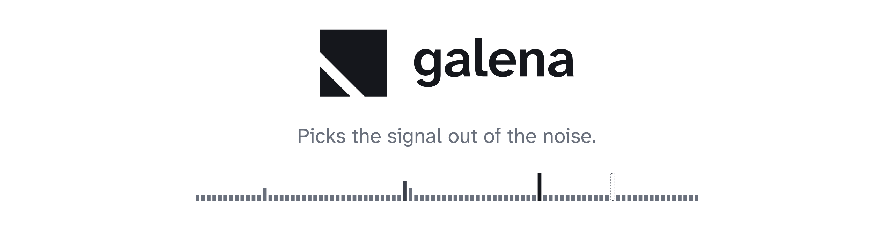
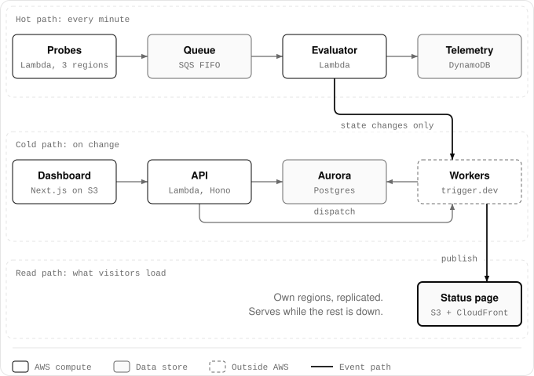

<p align="center">
  <picture>
    <source media="(prefers-color-scheme: dark)" srcset=".github/assets/readme-header-dark.png">
    
  </picture>
</p>

<p align="center">
  <a href="https://galena.astrl.me">Website</a>&nbsp;&nbsp;&nbsp;
  <a href="https://galena.astrl.me/docs/">Documentation</a>&nbsp;&nbsp;&nbsp;
  <a href="https://galena.astrl.me/docs/getting-started/self-hosting/">Deploy to AWS</a>&nbsp;&nbsp;&nbsp;
  <a href="LICENSE"></a>
</p>

Galena is an open-source status page that you deploy into your own AWS account. It checks your
services every minute from three AWS regions, decides when something is really down, and
publishes a static status page that keeps serving when everything else is not.

> **In active development.** There is no release yet. See [What works today](#what-works-today).

## What it does

- **Checks** every HTTP monitor once a minute from three probe regions, with DNS, connect, TLS
  and time-to-first-byte timings for each check.
- **Decides** a monitor is down only when enough regions agree, and never on a single failed
  check. A region whose own network looks broken leaves the vote, and a monitor that keeps
  flipping is marked flapping instead of paging people every minute.
- **Publishes** the status page as static files on S3 and CloudFront, in a region of its own,
  with a copy in a second region. Visitors never reach the API or the database, so the page
  stays up when they are down.
- **Tells people** by email (double opt-in, one-click unsubscribe), Slack and signed webhooks
  when an incident or maintenance window is posted.
- **Runs** incidents and maintenance from a dashboard, behind email and password sign-in with
  TOTP two-factor.

## How it fits together

Galena is three paths that fail independently. A visitor's request only ever touches the read
path, so if the API, the database and trigger.dev are all down at once, the last published page
still serves.

<p align="center">
  <picture>
    <source media="(prefers-color-scheme: dark)" srcset=".github/assets/overview-dark.svg">
    
  </picture>
</p>

| Path | What runs | What it does |
| --- | --- | --- |
| Hot path | Probe Lambdas in three regions, an SQS FIFO queue, an evaluator Lambda, DynamoDB | Checks every monitor every minute and works out each monitor's state |
| Cold path | The API on Lambda, Aurora Serverless v2, trigger.dev tasks | Incidents, maintenance, notifications, and publishing the page |
| Read path | S3 and CloudFront in separate regions | Serves the status page and its data files |

## What works today

- Sign-in with email and password and TOTP two-factor, for an owner created with one API request
  on first run.
- Components and groups, HTTP monitors with per-region results, and detection across regions.
- Incidents with updates and impact, and maintenance windows that start and finish on their own.
- Incidents opened from monitors, following each monitor's publish policy: published at once, or
  drafted and published after 10 minutes if the monitor is still down. They move to Monitoring
  when it recovers, back to Investigating if it fails again, and resolve once it is stable.
- The static status page: a 90-day history per component, incident pages with a timeline of
  updates, RSS and Atom feeds, a status badge and state favicons. A component that no monitor
  reports on shows "No data" rather than a made-up 100%.
- Email subscribers, Slack incoming webhooks and signed outgoing webhooks.
- A dashboard whose forms open in a side sheet and keep what you typed as a draft.

Next: approving or dismissing drafts in Slack and in the dashboard, and a live demo. After
that: alert ingest, Statuspage-compatible files, API keys, and a settings screen for members,
two-factor and GitHub sign-in. See the
[roadmap](https://galena.astrl.me/docs/roadmap/).

## Run it locally

You need Node.js 24, pnpm 11 (`corepack enable` picks up the version in `package.json`) and
Docker. Google Chrome runs the end-to-end tests.

```bash
git clone https://github.com/astrlme/galena.git
cd galena
pnpm install
pnpm dev
```

`pnpm dev` starts Postgres 16 and DynamoDB Local in Docker, applies the migrations, seeds a
local workspace and runs:

| Address | What |
| --- | --- |
| <http://localhost:3000> | The dashboard |
| <http://localhost:4321> | The status page, built from a fixture snapshot |
| <http://localhost:8787> | The API |

It also runs the hot path in one process: three simulated probe regions check every enabled
monitor each minute. Sign in as `owner@example.com` with `galena-local-owner`. The seed refuses
any database but the local one, so this account exists nowhere else.

Publishing, emails, Slack and webhooks run as trigger.dev tasks; the
[local development guide](https://galena.astrl.me/docs/getting-started/local-development/) shows
how to run them against a trigger.dev project of your own.

## Deploy to AWS

Galena deploys with the AWS CDK from a GitHub Actions workflow that signs in to AWS with OIDC, so
no AWS keys are stored in GitHub. You need an AWS account that holds nothing but Galena, a fork
of this repository, a trigger.dev account and a domain whose DNS you control. The
[self-hosting guide](https://galena.astrl.me/docs/getting-started/self-hosting/) goes from an
empty account to a live status page.

## Commands

| Command | What it does |
| --- | --- |
| `pnpm check` | Lint, typecheck, unit tests and import-boundary rules. Run it before every commit. |
| `pnpm test` | Unit tests only |
| `pnpm test:int` | Integration tests against throwaway Postgres and DynamoDB Local containers |
| `pnpm test:e2e` | Playwright and axe against the local dashboard, in light and dark mode |
| `pnpm check:page` | Builds the status page and checks Lighthouse, accessibility and its size budgets |
| `pnpm replay` | Replays recorded outage scenarios through the detection rules |
| `pnpm db:generate` | Generates a migration after a schema change |
| `pnpm api:generate` | Regenerates `openapi.json` and the dashboard's typed client after a route change |
| `pnpm infra:synth` | Synthesizes the CDK app and runs cdk-nag |

## Repository layout

| Path | Contents |
| --- | --- |
| `apps/api` | Hono API on Lambda: auth, components, monitors, incidents, maintenance, subscribers |
| `apps/web` | Next.js dashboard, website and docs, exported as static files |
| `apps/status` | Astro status page, built from a published snapshot |
| `apps/probe` | Probe Lambda: runs the checks in each region |
| `apps/evaluator` | Evaluator Lambda: turns check results into monitor state |
| `apps/workers` | trigger.dev tasks: publishing, uptime history, notifications |
| `packages/contracts` | Zod schemas and types shared by every app |
| `packages/core` | Domain logic without I/O: detection, status, uptime, roles |
| `packages/db` | Drizzle schema, migrations, repositories |
| `packages/publisher` | The page's feeds, badge and favicons, built from a snapshot |
| `packages/emails` | Notification emails |
| `packages/integrations` | SSRF guard, HTTP checker, Slack and webhook delivery |
| `packages/ui` | Design tokens |
| `infra` | AWS CDK app |

## Tests

- **Unit tests** sit next to the code (`*.test.ts`) and need no network or Docker. Detection is
  covered by example scenarios, fast-check property tests and replay scenarios in
  `test/fixtures/replay`.
- **Integration tests** (`*.int.test.ts`) run against Postgres 16 in Testcontainers and against
  DynamoDB Local.
- **End-to-end tests** (`apps/web/e2e`) drive the dashboard in Chrome, at desktop and phone
  widths, and check accessibility (WCAG 2.2 AA) in light and dark mode.

## Contributing

Read the [contributing guide](https://galena.astrl.me/docs/contributing/) first: it covers the
rules the code keeps, such as the static status page and the isolated hot path, and how changes
are tested.

## License

[Apache-2.0](LICENSE)
